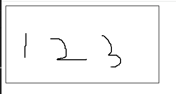
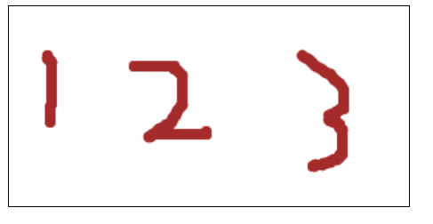

# `电子签名`

>  原理

在按下的时候开始画线，移动的过程中跟随鼠标坐标持续画线,
所以，我们需要监听鼠标按下移动事件， `mouse`

>  雏形

首先需要创建一个canvas

```html
<canvas id="cvs"></canvas>
```

然后我们获取到这个元素并对其挂载上按下移动抬起的事件
```js
const cvs = document.getElementById('cvs')
cvs.addEventListener('mousedown', (e) => {})
cvs.addEventListener('mousemove', (e) => {})
cvs.addEventListener('mouseup', (e) => {})
```

我们需要在鼠标按下状态时，再对移动事件进行处理，所以定义一个变量来存储是否是按下状态
```js
const cvs = document.getElementById('cvs')
let isDown = false
cvs.addEventListener('mousedown', (e) => {
  isDown = true
})
cvs.addEventListener('mousemove', (e) => {
  if(!isDown) {
    return
  }
})
cvs.addEventListener('mouseup', (e) => {
  isDown = false
})
```

>  开始绘制

在我们按下鼠标移动的过程中，会记录下非常多的点，将这些点连成线，就可以描绘出鼠标移动的轨迹

```js
const cvs = document.getElementById('cvs')
const ctx = cvs.getContext('2d')
let isDown = false
cvs.addEventListener('mousedown', (e) => {
  isDown = true
  console.log(e)
  ctx.moveTo(e.pageX, e.pageY)
})
cvs.addEventListener('mousemove', (e) => {
  if(!isDown) {
    return
  }
  ctx.lineTo(e.pageX, e.pageY)
  ctx.stroke()
})
cvs.addEventListener('mouseup', (e) => {
  isDown = false
})
```


> 自定义样式

```js
const drawLine = (x,y) => {
  ctx.beginPath();
  ctx.lineWidth = 8;  // 线宽度
  ctx.strokeStyle = 'brown';  //线颜色
  ctx.lineCap = 'round'
  ctx.lineJoin = "round";
  ctx.moveTo(lastX, lastY);
  ctx.lineTo(x, y);
  ctx.stroke();
  lastX = x;
  lastY = y;
}

```

