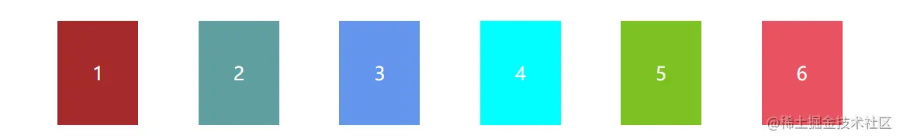

`Flex` 是 `Flexible Box` 的缩写，意为“弹性布局”或者“弹性盒子”，是 `CSS3` 中的一种新的布局模式，可以简便、完整、响应式地实现各种页面布局，当页面需要适应不同的屏幕大小以及设备类型时非常适用。  


容器默认存在两根轴，分别为水平的主轴（main axis）和垂直的交叉轴（cross axis）。主轴的开始位置叫做 main start，结束位置叫做 main end；交叉轴的开始位置叫做 cross start，结束位置叫做 cross end。项目默认沿主轴排列。单个项目占据的主轴空间叫做 main size，占据的交叉轴空间叫做 cross size  


**`flex容器`**

```
.container {
    display: flex;
}
```

**`flex属性`**

1、**`flex-direction`**： row|clumn|row-reverse|column-reverse（**决定主轴的方向**）

默认值：`row`，从左向右，横向排列
  


`column`，从上到下，纵向排列  

  


`row-reverse`，从右向左，横向排列  

  


`column-reverse`，从下到上，纵向排列  

  


2、**`flex-wrap`**： nowrap|wrap 决定是否换行

`nowrap`：当宽高固定，超出父级时，不换行  

 


`wrap`：当宽高固定，超出父级时，换行  

 


`wrap-reverse`：换行，第一行在下面  

 


3、**`justify-content`：** center | flex-start | flex-end | space-between | space-around | space-evenly （在主轴的对齐方式）

`center`：居中   

 


`flex-start`：从左向右  

 


`flex-end`：从右向左

 


`space-between`：两端对齐，间隔相等，即剩余空间等分成间隙。  

 


`space-around`：每个块两侧的间隔相等，块之间的间隔比块与边缘的间隔大一倍。  

 


`space-evenly`：每个块两侧的间隔相等，块之间的间隔与块与边缘的间隔相等  

 


4、**`align-items`**：center | flex-start | flex-end | stretch （在交叉轴的对齐方式）

`center`：居中  


 


`flex-start`： 从上到下  


 


`flex-end`：从下到上

 


`stretch`：不设置高度时，会铺满   

 


5、**`align-content`：** center | flex-start | flex-end | space-around | space-between | stretch  （多跟轴线的对齐方式，当flex-wrap:nowrap时不生效）

`center`：居中

 


`flex-start`

 


`flex-end`

 


`space-around`：上下间距相同  

 


`space-between`：两端对齐  

 


### `flex item`属性

1：**`order`** 排序，默认为0，值越小越靠前。

```
<!DOCTYPE html><html><head>    <meta charset="utf-8">    <style>        .parent {            display: flex;            color: #ffffff;        }        .child-1 {            background-color: brown;        }        .child-2 {            background-color: cadetblue;        }        .child-3 {            background-color: cornflowerblue;            order: 1;        }        .child-4 {            background-color: aqua;        }        .child-5 {            background-color: rgb(125, 194, 35);        }        .child-6 {            background-color: rgb(233, 83, 98);        }        .child {            padding: 30px;            text-align: center;            margin: 10px;        }    </style></head><body>    <div class="parent">        <div class="child child-1">1</div>        <div class="child child-2">2</div>        <div class="child child-3">3</div>        <div class="child child-4">4</div>        <div class="child child-5">5</div>        <div class="child child-6">6</div>    </div></body></html>
```

```
```

给child-3设置order后，3展示在了最后一位

2、`flex-basis`：默认`auto`，根据父级宽度百分比展示宽度，当宽度设置为0%时，块会被隐藏。最大展示父级宽度。

设置flex-basis后，之前设置的width将会失效。

```
.child-1 {
    flex-basis: 30%;
}
```

  

 


3、`flex-grow`：放大比例，默认为0，最大放大至剩余空间。

```
.child {
    flex-grow: 1;
}
.child-1 {
    flex-grow: 4;
}
```

 


4、`flex-shrink`：缩小比例，默认为0，当父级宽度不够时缩小，flex-wrap: wrap下无效

```
.child {
    flex-shrink: 1;
}
.child-1 {
    flex-shrink: 3
}
```

 


5、**`align-self`：当前块与其他块使用不一样的对齐方式**

 
