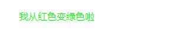
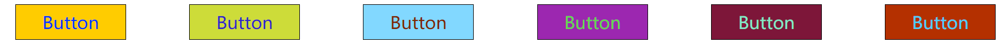
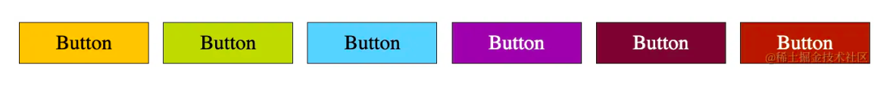

# `相对颜色`
> 相对颜色核心功能就是**让我们能够基于一个现有颜色 A，通过一定的转换规则，快速生成我们想要的颜色 B**。
```html
<div class="text">我从红色</div>
```

```css
 .text {
    color: rgb(255, 0, 0);
  }
```
如何将上面的红色转变为`rgb(0, 255, 0)`
```css
 .text {
    --color: rgb(255, 0, 0);
    color: rgb(from var(--color) calc(r - 255) calc(g + 255) b);  /* result = rgb(0, 255, 0) */
  }
```


##### **`from关键字`**
`from` 关键字，它是相对颜色的核心。它表示会将`from`关键字后的颜色定义转换为相对颜色！在`from`关键字后面，CSS 会生成另一种颜色。

`from` 后面通常会接一个颜色值，这个颜色值可以是任意颜色表示法，或者是一个 CSS 变量

```css
p {
    color: rgba(from #ff0000) r g b);
    color: rgb(from rgb(255, 0, 0) r g b);
    color: rgb(from hsl(0deg, 100%, 50%) r g b);
    color: rgb(from var(--hotpink) r g b);
}
```

##### **`使用 CSS 相对颜色，实现文字颜色自适应背景`**
比如我们要给网站做一个自动换肤的功能，为了使文字在任何背景颜色下都正常展现（譬如当底色为黑色时文字应该是白色，当背景为白色时，文字应该为黑色）
在之前，可以利用 mix-blend-mode: difference 进行一定程度的适配
```css
div {
    // 不确定的背景色
}
p {
    color: #fff;
    mix-blend-mode: difference;
}
```
在一定情况下，前景文字颜色还是会有一点瑕疵。并且，混合模式这个方案最大的问题是会影响清晰度。

###### **利用 CSS 相对颜色，反转颜色**

- 我们可以利用相对颜色的能力，基于背景色颜色进行反转，赋值给 color。

- 一种方法是将颜色转换为 RGB，然后从 1 中减去每个通道的值。

```css
p {
    /** 任意背景色 **/
    --bg: #ffcc00;
    background: var(--bg);

    color: rgb(from var(--bg) calc(255 - r) calc(255 - g) calc(255 - b));  /** 基于背景反转颜色 **/
}

```


##### `color-contrast()`

css还有个实验阶段的属性`color-contrast()`，函数标记接收一个 color 值，并将其与其他的 color 值比较，从列表中选择最高对比度的颜色

>  语法

```css
color-contrast(wheat vs tan, sienna, #d2691e)
color-contrast(#008080 vs olive, var(--myColor), #d2691e)
```

>  值

函数标记：color-contrast(color vs color-list)

###### color

有效的color值


###### color-list
由逗号分隔的列表，至少两个值，以与第一个值进行比较。


```css
 color: color-contrast(var(--bg) vs white, black);
```

