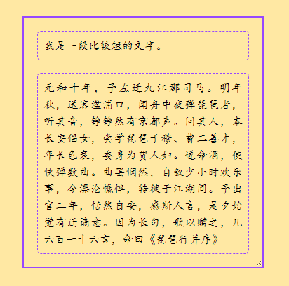
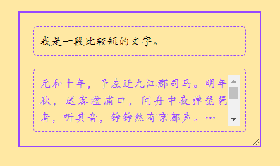

`时代在进步，css已经变成我高攀不起的样子了`

# `1、css滚动驱动动画`

要实现文本溢出检测，需要用到两个新特性

- CSS 滚动驱动动画
- CSS 样式查询

> `animation-timeline`

```css
  animation-timeline: scroll();
```
`animation-timeline`表示动画时间线（或者叫时间轴），用于控制 CSS 动画进度的时间线

```html
 <div class="con">
    <div class="text-wrap">
      <div class="text-content">
        <label class="expand"><input type="checkbox" hidden></label>
        我是一段比较短的文字。
      </div>
    </div>
    <div class="text-wrap">
      <div class="text-content">
        <label class="expand"><input type="checkbox" hidden></label>
        元和十年，予左迁九江郡司马。明年秋，送客湓浦口，闻舟中夜弹琵琶者，听其音，铮铮然有京都声。问其人，本长安倡女，尝学琵琶于穆、曹二善才，年长色衰，委身为贾人妇。遂命酒，使快弹数曲。曲罢悯然，自叙少小时欢乐事，今漂沦憔悴，转徙于江湖间。予出官二年，恬然自安，感斯人言，是夕始觉有迁谪意。因为长句，歌以赠之，凡六百一十六言，命曰《琵琶行并序》
      </div>
    </div>
  </div>
```
 

我们给左边加一个滚动驱动动画，改变文本的颜色

```css
 .text-content{
    display: -webkit-box;
    -webkit-box-orient: vertical;
    -webkit-line-clamp: 3;
    overflow: auto;
    animation: check 1s;
    animation-timeline: scroll(self);
  }
  @keyframes check{
    from,to {
      color: #9747FF;
    }
  }
```

 

有滚动时，文字会改变颜色，这样，我们可以知道容器是否可以滚动

`scroll(self)`，`self`表示监听自身滚动，默认是最近的祖先滚动容器

然后我们可以给文本加一个CSS变量--trunc，表示截断
```css
 .text-content{
    --trunk: false;
  }
```

在滚动驱动中改变变量的值

```css
 @keyframes check{
    from,to {
      --trunk: true;
    }
  }
```

最后我们就可以查询这个样式，给子元素设置样式了

```css
 @container style(--trunk: true) {
  .expand{
    display: initial;
  }
 } 
```