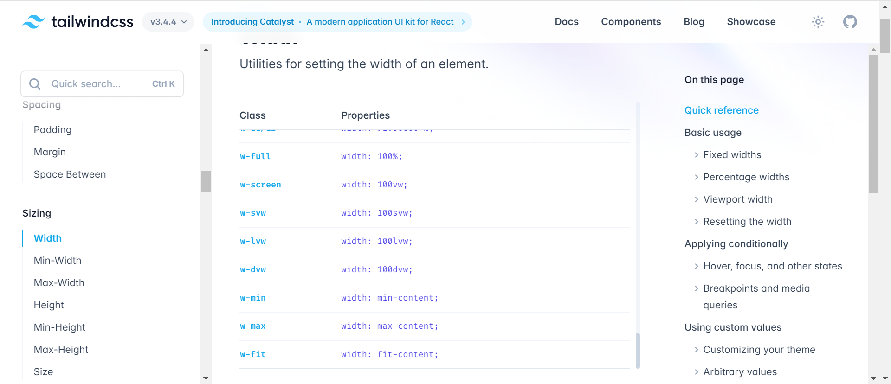

# `什么是UnoCSS`

UnoCSS` 是即时原子 `CSS` 引擎，旨在灵活和可扩展。核心是不带偏见的，所有的 `CSS` 工具类都是通过预设提供的。

**使用UnoCSS**

`UnoCSS` 本身不提供样式，是需要通过加载不同的预设来使用的，包括`Tailwind CSS、Windi CSS、Bootstrap、Tachyons` 等的共同超集

比如，要实现宽度100%功能时，可以查阅 [tailwindcss](https://tailwindcss.com/docs/width) 的文档，找到设置宽度和高度的地方：

 

```html
<template>
  <n-layout has-sider w-full>
  	<!-- ...... -->
  </n-layout>
</template>

```

**UnoCSS 的快捷方式（shortcuts）**

`shortcuts` 就是将多个规则组合成一个单写

例如 `w-full`、`h-full`，可能经常有一些组件，需要添加这两个属性，我们可以通过配置一个 `wh-full` 的快捷方式，来组合这两个规则。

```javascript
UnoCSS({
  shortcuts: {
    'wh-full': 'w-full h-full'
  },
  presets: [presetUno(), presetAttributify()]
})

```

这样就可以使用 `wh-full` 了

``` html
<template>
  <n-layout has-sider w-full h-full>
  	<!-- ...... -->
  </n-layout>
</template>

```

**UnoCSS配置文件**

`UnoCSS` 官方强烈推荐使用一个专用的 `uno.config.ts` 文件来配置我们的 `UnoCSS`，与在 `vite.config.ts` 中内联配置相比，专用的配置文件，将更好地与 `IDEs` 和其他工具集成，例如 `ESLint plugin`，并且能够更好地支持 `HMR`（热更新）。

所以呢，我们这里按照官方文档，来将我们项目中的 `UnoCSS` 配置到一个专用的 `uno.config.ts` 文件中。

在根目录新建 `uno.config.ts` 文件：

``` javascript
import { defineConfig, presetAttributify, presetUno } from 'unocss'

export default defineConfig({
  shortcuts: {
    'wh-full': 'w-full h-full'
  },
  presets: [presetUno(), presetAttributify()]
})

```

默认情况下，`UnoCSS` 将自动在项目根目录查找 `uno.config.{js.ts}` 或 `unocss.config.{js,ts}`文件，所以新建后就可以了不需要引入该文件。